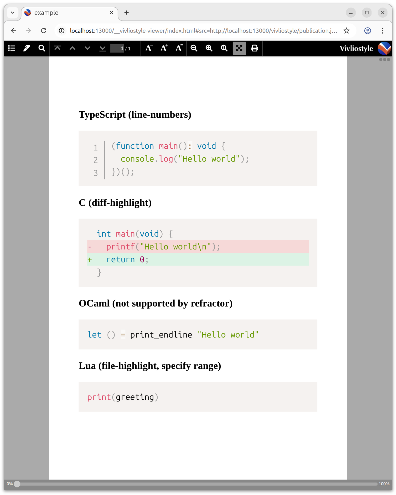

# @u1f992/rehype-spectra

[Prism](https://prismjs.com/), running within [JSDOM](https://github.com/jsdom/jsdom?tab=readme-ov-file#interfacing-with-the-nodejs-vm-module-using-getinternalvmcontext). Provides similar effects to [wooorm/refractor](https://github.com/wooorm/refractor) while offering broader compatibility with official Prism plugins.

